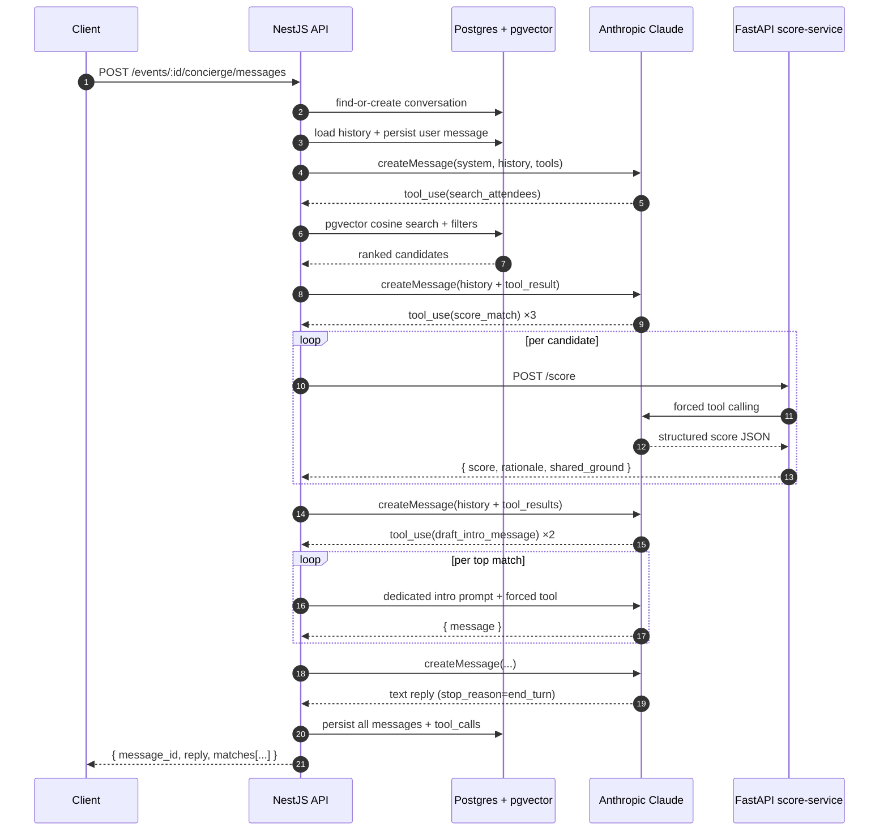

# MyConnect.ai — Networking Concierge

A backend service that lets a conference attendee chat with an AI concierge to get ranked, reasoned matches with other attendees at the same event, plus drafted intro messages they can send.

> **Status:** take-home submission for MyConnect.ai Senior Backend Engineer (AI Focus).
> Written by **Kardi Ibrahim**.
> A 5–8 minute walkthrough video is provided separately in the submission email.

---

## Table of Contents

1. [Quick Start](#1-quick-start)
2. [API Endpoints](#2-api-endpoints)
3. [Architecture Overview](#3-architecture-overview)
4. [Stack Choices](#4-stack-choices)
5. [Running Tests](#5-running-tests)
6. [Observability in Production](#6-observability-in-production)
7. [Cost Awareness](#7-cost-awareness)
8. [Engineering Trade-offs](#8-engineering-trade-offs)
9. [Documented Assumptions](#9-documented-assumptions)
10. [What I'd Do With More Time](#10-what-id-do-with-more-time)
11. [How I Used AI Assistants](#11-how-i-used-ai-assistants)
12. [Further Reading](#12-further-reading)

---

## 1. Quick Start

### Prerequisites

| | Version | Notes |
|---|---|---|
| Node.js | 20+ (tested on 22.17) | Runtime for the NestJS API |
| pnpm | 10+ | Enable via `corepack enable && corepack prepare pnpm@latest --activate` |
| Docker | 24+ | Required for Postgres + the full stack |
| Python | 3.12 (managed by `uv`) | `uv` installs the right version automatically |
| `uv` | Latest | `pip install uv` or [installer script](https://docs.astral.sh/uv/) |

### Setup

```bash
# 1. Clone the repo
git clone <repo-url>
cd networking-concierge

# 2. Configure secrets
cp .env.example .env
# Edit .env and fill in:
#   ANTHROPIC_API_KEY (from console.anthropic.com)
#   OPENAI_API_KEY    (from platform.openai.com)

# 3. Boot the full stack
docker compose --profile full up -d

# 4. Apply migrations and seed demo data
#    (db:migrate runs `prisma generate` + `prisma migrate deploy` together;
#     db:seed also runs `prisma generate` first as a safety net since pnpm v8+
#     blocks postinstall scripts that would normally do it.)
cd api
pnpm install
pnpm db:migrate
pnpm db:seed
cd ..

# 5. (One-time) Create the test database for e2e tests
cd api && pnpm db:test:setup && cd ..

# 6. Verify
curl http://localhost:3000/health    # NestJS API
curl http://localhost:8000/health    # FastAPI score-service
```

### Optional: pgAdmin for visual DB inspection

```bash
docker compose --profile tools up -d pgadmin
# Open http://localhost:5050
# Login: admin@example.com / admin
# Add server with host=postgres, port=5432, db=myconnect, user/pass=postgres/postgres
```

### Running the API in dev mode (hot reload)

If you prefer to work outside Docker for the API:

```bash
docker compose up -d postgres        # only DB in Docker
cd api && pnpm start:dev              # NestJS in watch mode

# In another terminal:
cd score-service && uv run uvicorn app.main:app --reload --port 8000
```

### Troubleshooting

- **`pnpm install` fails on a fresh clone**: delete `node_modules/` and re-run. The repo uses `node-linker=hoisted` (see [`api/.npmrc`](api/.npmrc)) for Prisma 7 compatibility.
- **Port 5432 already in use**: this repo binds Postgres to host port **5433** to avoid conflicts with native Postgres installations. The internal container port is still 5432, so connections from inside the compose network use `postgres:5432`.

---

## 2. API Endpoints

### Summary

| Method | Path | Description |
|---|---|---|
| `GET` | `/health` | Liveness check |
| `POST` | `/events` | Create an event |
| `GET` | `/events?page&limit` | List events, paginated |
| `POST` | `/events/:eventId/attendees` | Register an attendee (generates embedding) |
| `GET` | `/events/:eventId/attendees?page&limit&role&skills` | List attendees with filters |
| `POST` | `/events/:eventId/concierge/messages` | Send a message to the AI concierge — runs the agent loop |
| `POST` | `/events/:eventId/concierge/messages/:messageId/feedback` | Rate a concierge response (1–5 + optional notes) |

All errors return a structured JSON envelope:

```jsonc
{
  "statusCode": 400,
  "error": "Bad Request",
  "message": ["title must be longer than or equal to 3 characters"],
  "requestId": "0d13f7d9-9429-49d4-b0b0-484bd803cf03",
  "path": "/events",
  "timestamp": "2026-04-30T06:38:30.318Z"
}
```

Validation uses `class-validator`; the `message` field is either a string (single error) or an array (multiple field errors). Common status codes:

- `400` — request body or query failed validation
- `404` — resource not found, **or** ownership check failed (intentional, see [§9 — Documented Assumptions](#9-documented-assumptions))
- `409` — uniqueness conflict (e.g. duplicate feedback)
- `429` — rate-limited (10 messages/min per attendee on the concierge endpoint)

---

### `GET /health`

Liveness probe.

**Response (200)**
```jsonc
{
  "status": "ok",
  "env": "production",
  "uptime": 24,
  "timestamp": "2026-04-30T06:38:30.318Z"
}
```

---

### `POST /events`

Create an event.

**Request body**
```json
{
  "title": "Southeast Asia AI Summit 2026",
  "startsAt": "2026-05-15T09:00:00Z",
  "endsAt": "2026-05-17T18:00:00Z",
  "location": "Jakarta, Indonesia"
}
```

Validation:
- `title` — non-empty, ≥3 characters.
- `startsAt`, `endsAt` — ISO 8601 dates; `startsAt < endsAt`.
- `location` — non-empty.

**Response (201)**
```jsonc
{
  "id": "b566148f-0c25-47bf-9123-8b7be21566ec",
  "title": "Southeast Asia AI Summit 2026",
  "startsAt": "2026-05-15T09:00:00.000Z",
  "endsAt": "2026-05-17T18:00:00.000Z",
  "location": "Jakarta, Indonesia",
  "createdAt": "2026-04-30T06:38:30.318Z"
}
```

---

### `GET /events`

List events, newest first.

**Query**
- `page` — integer ≥1, default 1.
- `limit` — integer 1–100, default 20.

**Response (200)**
```jsonc
{
  "items": [
    { "id": "...", "title": "...", "startsAt": "...", "endsAt": "...", "location": "...", "createdAt": "..." }
  ],
  "total": 1,
  "page": 1,
  "limit": 20
}
```

---

### `POST /events/:eventId/attendees`

Register an attendee. The server embeds `headline + bio + skills + looking_for` via OpenAI and writes the 1536-dim vector to `attendees.embedding` using a parameter-bound raw insert.

**Request body**
```json
{
  "name": "Sarah Lim",
  "headline": "Founder & CEO at LedgerAI",
  "bio": "Building LedgerAI, a B2B finance automation platform serving SMEs in Southeast Asia.",
  "company": "LedgerAI",
  "role": "founder",
  "skills": ["fintech", "b2b-saas", "leadership"],
  "lookingFor": "A backend co-founder with NestJS / B2B SaaS experience.",
  "openToChat": true
}
```

Validation:
- All text fields — non-empty.
- `skills` — array of strings, ≥1 item.
- `openToChat` — optional boolean (default `true`).

**Response (201)** — the `embedding` column is intentionally omitted from the response (it is large and not part of the public contract).
```jsonc
{
  "id": "7a958c2e-61d6-42cb-b74f-6b92d0d8eb52",
  "eventId": "b566148f-0c25-47bf-9123-8b7be21566ec",
  "name": "Sarah Lim",
  "headline": "Founder & CEO at LedgerAI",
  "bio": "...",
  "company": "LedgerAI",
  "role": "founder",
  "skills": ["fintech", "b2b-saas", "leadership"],
  "lookingFor": "...",
  "openToChat": true,
  "createdAt": "2026-04-30T06:38:30.318Z"
}
```

---

### `GET /events/:eventId/attendees`

List attendees in an event with optional filters.

**Query**
- `page`, `limit` — same pagination as `/events`.
- `role` — optional exact match (e.g. `founder`, `engineer`, `investor`).
- `skills` — optional comma-separated CSV (`?skills=ai,b2b-saas`). Match semantics: any-of (Postgres array overlap `&&`).

**Response (200)** — same shape as `GET /events`, but `items` are attendee objects.

---

### `POST /events/:eventId/concierge/messages`

Send a message to the AI concierge. Runs the agent loop (max 6 iterations) and persists every message + tool call. **Latency is dominated by the LLM round-trips and typically lands at 30–60 seconds per turn.** A 90 s server-side timeout is in place.

Rate-limited at 10 requests / minute / attendee.

**Request body**
```json
{
  "attendee_id": "7a958c2e-61d6-42cb-b74f-6b92d0d8eb52",
  "message": "I'm a backend engineer in Jakarta with 8 years experience. Looking for an AI startup co-founder, ideally B2B SaaS in Southeast Asia."
}
```

**Response (201)**
```jsonc
{
  "message_id": "fac4f2c7-23d8-449e-95c5-945299369583",
  "reply": "Based on your goal, here are matches worth meeting: ...",
  "matches": [
    {
      "attendee_id": "...",
      "name": "Sarah Lim",
      "score": 92,
      "rationale": "Both work in B2B SaaS with NestJS background and SEA focus.",
      "shared_ground": ["NestJS", "B2B SaaS", "SEA market"],
      "draft_intro": "Hi Sarah — saw your work on LedgerAI..."
    }
  ]
}
```

`matches` may be empty if the agent could not surface a confident scored candidate within 6 iterations — the natural-language `reply` is still returned.

---

### `POST /events/:eventId/concierge/messages/:messageId/feedback`

Rate a concierge response. Useful for collecting training signal for a re-ranking model later (see [§10 What I'd Do With More Time](#10-what-id-do-with-more-time)).

**Request body**
```json
{
  "attendee_id": "7a958c2e-61d6-42cb-b74f-6b92d0d8eb52",
  "rating": 5,
  "notes": "Sarah was exactly what I was looking for."
}
```

Validation:
- `attendee_id` — UUID; **must own the conversation that the message belongs to**, otherwise a `404` is returned (we deliberately do not leak the existence of other attendees' messages with a `403`).
- `rating` — integer 1–5.
- `notes` — optional string ≤1000 characters.

**Response (201)**
```jsonc
{
  "id": "...",
  "messageId": "fac4f2c7-23d8-449e-95c5-945299369583",
  "rating": 5,
  "notes": "Sarah was exactly what I was looking for.",
  "createdAt": "2026-04-30T06:38:30.318Z"
}
```

**`409 Conflict`** is returned if feedback already exists for the same message (unique constraint on `feedback.message_id`).

---

## 3. Architecture Overview

The concierge is a **stateful AI agent**: every turn loads the prior conversation history from Postgres and reasons over it, so the user can naturally refer back to "the first one you suggested" in turn 2 without re-stating their goal.

The agent has three tools, called via Anthropic's native function calling:

- **`search_attendees`** — semantic search over the attendee embeddings stored in pgvector, with optional `role` / `skills` filters layered on top.
- **`score_match`** — produces a structured score (0–100), rationale, and concrete shared ground for one candidate against the requester's intent. **This tool is implemented by a separate FastAPI service**, deliberately — it is the most ML-flavoured part of the system and the natural home for a future re-ranking model trained on the feedback ratings the API already collects.
- **`draft_intro_message`** — composes a personalised intro message from the requester to the recipient using a dedicated prompt and forced structured output.

Each turn runs the agent loop **capped at 6 iterations**. The cap is pinned to the PRD: beyond six rounds the model has either succeeded or is looping; we cut it off and return whatever scored matches we have, plus a natural-language reply.

Every step is persisted: the user message, every assistant response (including `tool_use` content blocks), every tool call (one row per call in `tool_calls`), and every tool result message. This is what makes conversations resumable — the next turn rebuilds the full Anthropic messages array directly from the database (`SELECT * FROM messages WHERE conversation_id = $1 ORDER BY created_at`), no in-memory state to lose on a deploy.



For deeper detail (data model, scaling to 10k attendees, PII, deployment topology), see [`docs/ARCHITECTURE.md`](docs/ARCHITECTURE.md).

---

## 4. Stack Choices

| Layer | Choice | Rationale |
|---|---|---|
| API framework | **NestJS 11** | Required by the brief. DI makes the LLM and the FastAPI client trivially mockable in tests. Modular structure naturally enforces no-god-services. |
| ORM | **Prisma 7** | Fastest path to a typed client + declarative migrations. The Unsupported `vector(1536)` column is reached through `prisma.$executeRaw\`...\`` tagged templates — fully parameter-bound, never concatenated. |
| Database | **PostgreSQL 16 + pgvector** | One source of truth. Avoids a second vector store (Pinecone/Weaviate) that would only earn its keep above ~100k attendees. ivfflat index on the embedding column for cosine similarity. |
| LLM | **Anthropic Claude Sonnet 4.6** | Strong native tool calling with parallel tool support, instruction-following holds up against long security-rule system prompts, competitive pricing. We use the **raw SDK**, not LangChain — the agent loop's tool lifecycle is explicit and easy to reason about. |
| Embeddings | **OpenAI `text-embedding-3-small`** (1536 dim) | Best quality/cost ratio for semantic search at this scale. Anthropic does not offer a first-party embedding model. |
| Polyglot service | **FastAPI + Pydantic + Anthropic async client** | The `score_match` tool is extracted into a Python microservice. Demonstrates the polyglot architecture from the JD and gives a clean home for ML-heavy iteration later (re-ranking, custom scorers). |
| Package manager | **pnpm 10** with `node-linker=hoisted` | Fast installs and a single lockfile. The hoisted linker is required for Prisma 7 CLI to find `@prisma/engines` reliably — see [`docs/TECH-DECISIONS.md` TD-007](docs/TECH-DECISIONS.md#td-007--pnpm-node-linkerhoisted-for-prisma-7-compatibility). |
| Python tooling | **uv** | Pins Python 3.12 per project regardless of the system Python; faster than `pip` + `venv`. |
| Logging | **`nestjs-pino`** | Structured JSON to stdout, request-correlation IDs via `X-Request-ID`, PII redaction for `bio`, `looking_for`, `name`, `email`, auth headers. |

---

## 5. Running Tests

### NestJS API

```bash
cd api

# Unit tests (53 tests across 12 spec files)
pnpm test

# End-to-end tests (4 tests, isolated `myconnect_test` DB)
pnpm db:test:setup     # one-time: create + migrate the test DB
pnpm test:e2e

# Type-check + lint
pnpm build
pnpm lint
```

Coverage:

- **Unit**: events, attendees, attendee-search ordering, embeddings + mock variant, sanitiser, LLM client retry, tool executor, conversation reconstruction, concierge agent loop, feedback ownership rules.
- **E2E**: full agent loop with stubbed `LlmService` + `ToolExecutorService` (4 LLM iterations: search → score → draft\_intro → end\_turn), conversation resumption (turn 2 sees turn 1's history), and a codified prompt-injection test (`[INST]` markers stripped, security rules present in system prompt).

### FastAPI score-service

```bash
cd score-service
uv sync
uv run pytest -v
```

2 tests cover Anthropic forced-tool-call parsing and the no-tool-call error path.

---

## 6. Observability in Production

The service emits structured JSON logs and CloudWatch-compatible metric events that a production deployment can ingest with minimal extra wiring.

### Logs (already implemented)

`nestjs-pino` writes one JSON line per request with `req_id`, `method`, `route`, `status`, `latency_ms`. PII fields (`bio`, `looking_for`, `name`, `email`, `authorization` and `cookie` headers) are redacted at info level. Each LLM call adds `model`, `input_tokens`, `output_tokens`, `latency_ms`, `stop_reason`, `iteration_index`, `attempt`.

### Metrics (already implemented)

`MetricsService.emit({ name, value, unit, dimensions })` writes a structured line carrying a `_metric` field with namespace `MyConnect/Concierge`. Two metrics are emitted today:

- `LlmCall` — value=latency\_ms, dimensions={model, stop\_reason, status}.
- `ToolDispatch` — value=latency\_ms, dimensions={tool, status}.

### Production wiring (documented; not deployed)

1. **Logs → CloudWatch / Azure Monitor**: deploy the container to ECS Fargate or Azure Container Apps with stdout captured by the platform agent (Fluent Bit on AWS, the built-in agent on Azure). No code changes required.
2. **Metrics → CloudWatch EMF**: configure Fluent Bit's `cloudwatch_logs` output with the `log_format json/emf` setting. The agent extracts the `_metric` field as a CloudWatch metric automatically.
3. **Traces → OpenTelemetry**: add `@opentelemetry/sdk-node` to the bootstrap with the OTLP exporter. One span per HTTP request, nested spans per `LlmService.createMessage` and `ToolExecutorService.dispatch`. Export to AWS X-Ray or Application Insights.
4. **Alerts**:
   - p95 concierge latency > 12 s for 5 minutes → page.
   - Error rate > 5 % for 5 minutes → page.
   - Daily LLM token spend > USD 50 → notify.

---

## 7. Cost Awareness

A typical concierge turn drives **4 Anthropic calls** (search → score → draft\_intro → end\_turn) plus **N score-service calls** (one per scored candidate, typically 3) and **M intro-drafter LLM calls** (typically 2). Total ≈ 6 LLM round-trips per turn.

Average tokens observed in dev:

- Per Sonnet 4.6 call: ~3 000 input tokens (system + history + tool defs) + ~400 output tokens.
- 6 × 3 000 = 18 000 input tokens, 6 × 400 = 2 400 output tokens.

Rough cost at current Sonnet 4.6 pricing (US$3 / MTok input, US$15 / MTok output):

- 0.018 × 3 + 0.0024 × 15 = **~US$0.09 per turn**.

OpenAI embedding cost for attendee registration is negligible (`text-embedding-3-small` at US$0.02 / MTok, ~150 tokens per attendee = US$0.000003).

**Suggested per-event budget**: a 1 000-attendee event with 30 % active in chat and 5 turns each → ~1 500 turns → ~US$135. Set a daily budget alert at this threshold.

Cost-reduction levers (deferred, see §10):

1. Anthropic prompt caching for the system prompt + tool definitions (constant across turns).
2. Conversation summarisation to compress long histories.
3. Cheaper model (Haiku or Sonnet 4.5) for the `draft_intro_message` sub-call.

---

## 8. Engineering Trade-offs

Honest list of what this submission optimises for and what it gives up:

1. **Synchronous agent loop with a 90 s HTTP timeout** rather than queue + SSE. Simpler to reason about and test. Production should move execution to BullMQ/Redis and stream results — flagged in §10.
2. **`requester_attendee_id` injected from server-side context** rather than passed by the LLM in the tool schema. Prevents the model from hallucinating a different requester. Deviates from the literal PRD §5.2 schema; documented because the security benefit is concrete.
3. **Idempotency-Key handling deferred**. The 10/min per-attendee throttle is the pragmatic defence for the take-home. Production needs proper idempotency (Redis-backed key store).
4. **No advisory lock per conversation**. Concurrent identical-attendee requests are unlikely in a demo; the unique constraint on `conversations(event_id, attendee_id)` already prevents duplicate conversations.
5. **Same-database e2e isolation via TRUNCATE before each test**, with the test DB built once via `pnpm db:test:setup`. Cheaper than testcontainers and reproducible across machines.
6. **`pnpm node-linker=hoisted`** trades pnpm strict isolation for Prisma 7 compatibility — see [TD-007](docs/TECH-DECISIONS.md#td-007--pnpm-node-linkerhoisted-for-prisma-7-compatibility).
7. **`crypto.randomUUID()` instead of the `uuid` package**. Avoids an ESM-only dependency that conflicts with Jest's CommonJS transform — see [TD-001](docs/TECH-DECISIONS.md#td-001--drop-uuid-package-use-cryptorandomuuid-for-request-ids).

The full reasoning per decision lives in [`docs/TECH-DECISIONS.md`](docs/TECH-DECISIONS.md). Each entry follows the same template (problem → choice → rejected alternatives → trade-off).

---

## 9. Documented Assumptions

Where the brief is silent, I made the following calls explicitly:

1. **One conversation per `(event_id, attendee_id)` pair** — enforced by a unique constraint. Re-engaging the concierge resumes the same conversation and re-loads full history.
2. **No authentication layer**. The brief did not require auth, so the feedback endpoint takes `attendee_id` in the body for ownership checks. A real deployment would replace this with a JWT.
3. **`requester_attendee_id` is injected server-side**, not exposed to the LLM. See trade-off #2 above.
4. **Skills filter uses "any of"** semantics (`hasSome` / Postgres `&&`). More lenient and matches typical search UX. "All of" can be a future query-param flag.
5. **Embedding source string** for an attendee is `headline + bio + skills.join(',') + looking_for`. Tested empirically against 15 seeded profiles to give sensible cosine ordering.
6. **Bio truncated to 500 characters** in `search_attendees` tool output. Keeps prompt budget manageable without losing the gist.
7. **Maximum 6 iterations per agent turn**. PRD-aligned. Beyond 6 the model has either succeeded or is looping; we cut it off and return whatever matches we have.

---

## 10. What I'd Do With More Time

Roughly in priority order:

1. **Stream responses** with Server-Sent Events. The current 30–60 s synchronous wait is not a great UX even with the timeout bumped to 90 s.
2. **Move the agent loop to a BullMQ + Redis queue**. Decouples HTTP latency from agent latency, enables horizontal worker scaling, and is the natural pairing for SSE.
3. **Anthropic prompt caching** on the system prompt and tool definitions. They are constant across turns; caching cuts ~60 % of the input tokens.
4. **Idempotency-Key header** with a Redis-backed dedupe window.
5. **Eval framework** with a small golden dataset of (attendee, query, expected\_top\_match) triples. Run on every PR; fail if match quality regresses.
6. **OpenTelemetry tracing** end-to-end (NestJS → score-service → Anthropic). Gives a flame graph of where latency is spent.
7. **Terraform module** for RDS, ECS Fargate, ALB, ElastiCache. `terraform plan` only — keeps the demo local.
8. **GitHub Actions pipeline** for lint, test, build, and image push to ECR.
9. **k6 load test** for `POST /concierge/messages` at 10/50/100 concurrent virtual users; report p50/p95/p99 with a writeup of the bottleneck (hint: it is always the LLM).
10. **Re-ranking model** in the FastAPI service trained on the feedback ratings the system already collects.
11. **PII data-protection job**: cascade-delete attendees → conversations → messages, cron-driven retention (90 days post-event).
12. **Multi-language support** for Indonesian and Mandarin — relevant for SEA conferences.

---

## 11. How I Used AI Assistants

The brief explicitly invites use of AI assistants and asks for a candid disclosure. Here is mine, framed by what a senior backend engineer is responsible for.

### What I (the engineer) decided

These are the decisions I drove and validated; the AI did not pick them on my behalf:

- **Architecture**: NestJS as the primary API, Prisma over Drizzle/TypeORM, Postgres + pgvector over a dedicated vector store, Anthropic raw SDK over LangChain, FastAPI as the polyglot service. Each has a recorded trade-off in [`docs/TECH-DECISIONS.md`](docs/TECH-DECISIONS.md).
- **Service boundaries**: where the agent loop lives (NestJS), what gets extracted (only `score_match`), and why (room for future ML/re-ranking work without redeploying the main API).
- **Security model**: prompt-injection defences (sanitiser strips known injection markers, attendee data wrapped in `<attendee_data>` tags, system prompt explicitly classifies tag content as data not instructions, score must reflect actual fit). The adversarial test in `concierge.e2e-spec.ts` validates the defence layers are in place.
- **Tool schema design**: the deviation that injects `requester_attendee_id` from server context rather than letting the LLM pass it. This is a security-driven choice.
- **Test strategy**: separate test database, deep-clone of LLM stub inputs to prevent post-call mutation, mock the LLM but exercise real Prisma + DB.
- **Deferral calls**: idempotency, advisory lock, streaming, prompt caching — what to ship and what to flag in §10.

### Where AI accelerated me

- **Drafting the execution plan** before any code — broke the work into 16 phases with a definition-of-done per phase and a per-phase commit boundary. The polished version is at [`docs/EXECUTION-PLAN.md`](docs/EXECUTION-PLAN.md), which also includes the acceptance matrix mapping every PRD requirement to the phase that implemented it.
- **Scaffolding boilerplate**: NestJS modules, controllers, DTOs, repository wrappers. I reviewed every generated file before committing.
- **Test mocks**: especially the Jest setup for the agent loop e2e where the message array is mutated post-call (the `structuredClone` insight came from the AI noticing the failure mode in the first run).
- **Tech-decision write-ups** (TD-001 through TD-007). I gave the AI the bug, the fix, and the rationale; it shaped the prose into the consistent template.
- **Pair-debugging Docker issues** with Prisma 7 + pnpm. The AI surfaced the public-hoist-pattern → node-linker=hoisted progression after I described the symptoms; I validated by reading the actual error chain.

### What I reviewed manually

- Every `.ts` and `.py` file before commit.
- All Prisma raw-SQL templates (paranoid about injection).
- The system prompts (security rules, instruction follow-through, tone).
- All Dockerfile changes — base image, user, healthcheck, layer order.
- Each commit message before push.

The AI is a fast pair programmer; the architecture, the priorities, and the trade-offs are mine to own.

---

## 12. Further Reading

- [`docs/PRD.md`](docs/PRD.md) — Product requirements (functional + non-functional).
- [`docs/ARCHITECTURE.md`](docs/ARCHITECTURE.md) — Detailed architecture: data model, agent state persistence, scaling to 10k attendees, PII and data protection, deployment topology.
- [`docs/TECH-DECISIONS.md`](docs/TECH-DECISIONS.md) — All execution-time decisions with problem / choice / rejected alternatives / trade-off.
- [`docs/EXECUTION-PLAN.md`](docs/EXECUTION-PLAN.md) — Acceptance matrix (every PRD requirement → phase), phase summary, self-imposed quality gate, and time-budget transparency.
- [`api/`](api/) — NestJS source. Entry: `api/src/main.ts`.
- [`score-service/`](score-service/) — FastAPI source. Entry: `score-service/app/main.py`.

---

*Walkthrough video and submission notes are provided in the submission email.*
